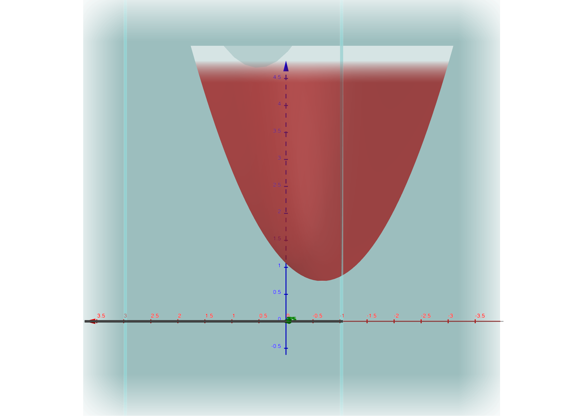

# Gurobi.go
This is a simple wrapper that goes around the C API for Gurobi.
When this module is installed properly (with `go generate`),
you can use it to set up Mathematical Programs with or
without using the [MatProInterface](https://github.com/MatProGo-dev/MatProInterface.go).

|  |  |
|:----------------------------------------------:|:---------------------------------------------:|
|    Effectively Solve Mathematical Programs     |  Using the Tools of Mathematical Programming  |

The above example will be discussed in more detail in a Wiki or example for this library.

## Installation

Warning: The setup script is designed to only work on Mac OS X. If you are interested in using this on a Windows machine, then there are no guarantees that it will work.

### Installation in Module

1. Use a "-d" `go get -d github.com/MatProGo-dev/Gurobi.go/gurobi`. Pay attention to which version appears in your terminal output.
2. Enter Go's internal installation of gurobi.go. For example, run `cd ~/go/pkg/mod/github.com/MatProGo-dev/Gurobi.go@v0.0.0-20221111000100-e629c3f29605` where the suffix is the version number from the previous output.
3. Run go generate with sudo privileges from this installation. `sudo go generate`.

### Development Installation

1. Clone the library using `git clone github.com/MatProGo-dev/Gurobi.go `
2. Run the setup script from inside the cloned repository: `go generate`.

## Usage

See the `testing` directory for some examples of how to use this.

Works in progress...

## LICENSE
See [LICENSE](LICENSE).

## To-Dos

* [ ] Create Documentation for how to implement QP1 with
  * [ ] MatProInterface.go
  * [ ] Gurobi.go